# 🌍 LULC Classification

Land Use/Land Cover (LULC) classification plays a vital role in environmental monitoring, ecological assessment, and urban planning. This project focuses on identifying four LULC categories:

- **Water**
- **Vegetation**
- **Buildup**
- **Bareland**

Using **XGBoost** and **RandomForest**, this project demonstrates an end-to-end workflow using **Sentinel-2 satellite imagery**, **ArcGIS Pro**, and **Machine Learning models** — specifically **XGBoost** and **Random Forest**.

The project integrates **remote sensing, geospatial analysis, and machine learning** to generate accurate LULC maps and evaluate model performance using industry-standard metrics.

---

# 🧠 Methodology Workflow

```mermaid
flowchart TD

A[Sentinel-2 Raster] -->
B[ArcGIS Pro – Pixel Extraction] -->
C[Balanced Training Dataset] -->
D["Train/Test Split → ML Training (XGBoost, RandomForest)"] -->
E["Evaluation <br/>(Confusion Matrix, Kappa, Errors)"] -->
F[Final LULC Classified Map] -->
G[Area Distribution Visualization]
```

---

# 🛰 Original Image → LULC Classified Image

### **Original Sentinel-2 Surface Image**

### **LULC Classified Output**

---

# 🛰 Dataset Creation & Preprocessing

### ✔ 1. **Study Area**

The study area consists of regions in **western Pune** and **southeastern Navi Mumbai**, India.

---

### ✔ 2. **Sentinel-2 Raster Data**
- Retrieved from ESA Copernicus Hub
- Out of the 12 available spectral bands, 11 were utilized for the analysis
- Atmospheric corrections applied using Copernicus browser tools

**True Color Image (Band 4, 3, 2):**  

---

### ✔ 3. **Raster Value Extraction in ArcGIS Pro**
Raster values were extracted for each plotted point across all 11 spectral bands.

---

### ✔ 4. **Supervised Dataset (Shapefile Output)**
The point feature class with spectral values was exported as a **shapefile**, forming the training dataset.

---

# 🤖 Machine Learning Models Used 

### **1️⃣ XGBoost Classifier**
- Gradient boosting method  
- Highly effective for structured tabular spectral data  
- Good performance with fewer parameters

### **2️⃣ RandomForest Classifier**
- Ensemble bagging method  
- Handles non-linear relationships well  
- Reduces overfitting via bootstrapped sampling 

---

# 📈 Model Results

Models were evaluated using:

- Cohen’s Kappa Score  
- Confusion Matrix  
- Producer’s Accuracy  
- User’s Accuracy  
- Commission Error  
- Omission Error  

---

## ⚡ **XGBoost Results**

**Cohen’s Kappa Score:** 96.57%

### **Producer’s & User’s Accuracy**
| Class         | Producer's Accuracy | User's Accuracy |
|--------------|---------------------|------------------|
| Water        | 100% | 100% |
| Vegetation   | 100% | 94.73% |
| Buildup | 88.23% | 100% |
| Bareland     | 100% | 94.44% |

### **Commission & Omission Error**
| Class         | Commission Error | Omission Error |
|--------------|------------------|----------------|
| Water        | 0% | 0% |
| Vegetation   | 5.55% | 0% |
| Buildup | 0% | 11.76% |
| Bareland     | 5.88% | 0% |

---

## 🌲 **RandomForest Results**

**Cohen’s Kappa Score:** 98.28%

### **Producer’s & User’s Accuracy**
| Class         | Producer's Accuracy | User's Accuracy |
|--------------|---------------------|------------------|
| Water        | 100% | 100% |
| Vegetation   | 100% | 100% |
| Buildup | 93.75% | 100% |
| Bareland     | 100% | 94.44% |

### **Commission & Omission Error**
| Class         | Commission Error | Omission Error |
|--------------|------------------|----------------|
| Water        | 0% | 0% |
| Vegetation   | 0% | 0% |
| Buildup | 0% | 6.25% |
| Bareland     | 5.88% | 0% |

---

# 🌍 LULC Area Distribution

### **Bar Chart of Area (sq. km)**
| XGBoost | RandomForest |
|---------|--------------|
|  |  |

### **Pie Chart: Proportion of Surface Area**
| XGBoost | RandomForest |
|---------|--------------|
|  |  |

---

# 🏁 Conclusion

This project successfully demonstrates the integration of **Sentinel-2 imagery**, **ArcGIS Pro**, and **Machine Learning algorithms** for accurate land use/land cover classification. Both XGBoost and Random Forest models achieved **high accuracy**, producing detailed LULC maps with strong agreement across classes.

While some misclassification occurred in spectrally similar regions, both models proved highly effective for large-scale environmental analysis. 

This workflow contributes to scalable and reproducible remote-sensing analysis for land-cover monitoring and environmental planning.

---

## 🧾 License

This project is licensed under the **MIT License**.  
Feel free to use, modify, and distribute with attribution.